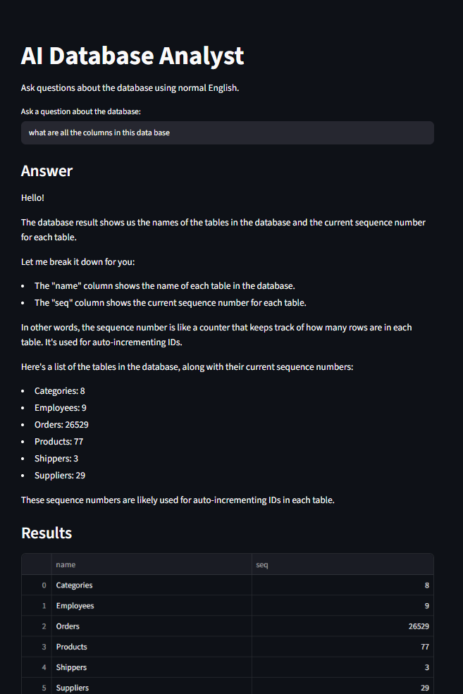
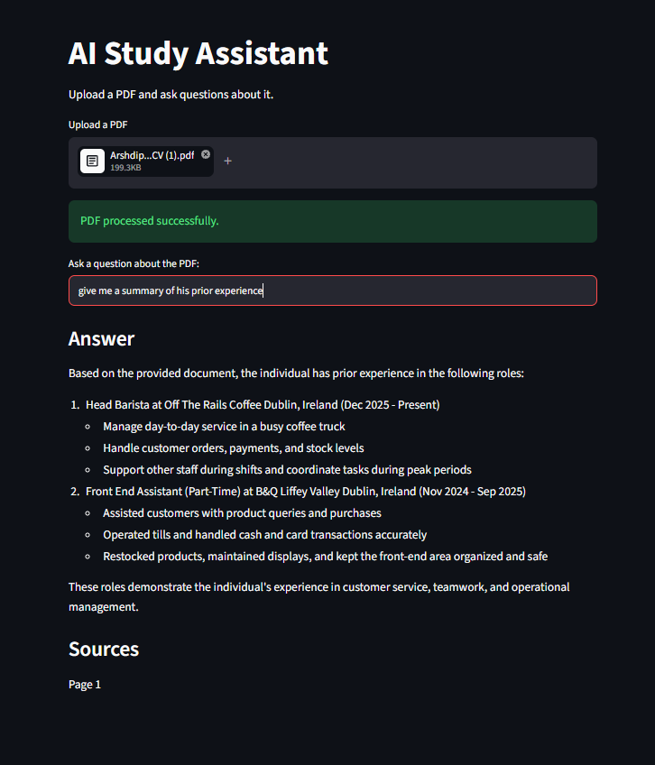

# AshsProjects

A collection of university, personal, and upcoming projects focused on data science, artificial intelligence, machine learning, and software development.

## AI Database Analyst

An AI-powered database assistant built with Python, SQLite, Streamlit, and Ollama.

The application allows users to ask questions about a database using normal English. The system reads the database structure, converts the user's question into SQL, checks that the generated query is safe, executes it, and then explains the results in plain English.

### Features

- Ask database questions using natural language
- Automatically reads database tables and column structure
- Converts user questions into SQLite queries
- Restricts generated SQL to read-only operations
- Blocks commands such as `DELETE`, `DROP`, `UPDATE`, `INSERT`, and `ALTER`
- Executes valid SQL queries against the database
- Displays results in a pandas DataFrame
- Shows the generated SQL query
- Uses Llama 3.2 locally through Ollama
- Generates a simple explanation of the returned results

### Tech Stack

- Python
- SQLite
- SQL
- Streamlit
- pandas
- LangChain
- Ollama
- Llama 3.2

### How It Works

```text
User Question
    ↓
Read Database Schema
    ↓
Llama 3.2
    ↓
Generate SQL Query
    ↓
SQL Safety Check
    ↓
Execute Query
    ↓
Return Database Results
    ↓
Llama 3.2
    ↓
Natural Language Explanation
```
### Demo

Below is an example of the application analysing the Northwind SQLite database using a natural-language question.



The application converts the user's question into SQL, executes the query against the database, displays the returned data, and generates a natural-language explanation of the results.

### Database Schema Detection

Before generating a query, the application reads the SQLite database structure.

It retrieves:

- Table names
- Column names
- Column data types

This information is passed to the language model so that it can generate SQL based on the actual structure of the database.

### Natural Language to SQL

The user's question is passed to Llama 3.2 along with the database schema.

For example:

```text
Which customers have placed the most orders?
```

The model generates an appropriate SQLite query based on the available tables and columns.

### SQL Safety

Before a generated query is executed, it passes through a validation step.

The application blocks SQL containing operations such as:

```text
DELETE
DROP
UPDATE
INSERT
ALTER
CREATE
REPLACE
```

Only queries beginning with:

```sql
SELECT
```

or:

```sql
WITH
```

are allowed to run.

This prevents the AI from intentionally or accidentally modifying the database.

### Query Results

After the SQL query is executed, the application retrieves:

- Column names
- Returned rows

The results are then displayed in a pandas DataFrame through the Streamlit interface.

### Result Explanation

The generated SQL and database results are passed back to Llama 3.2.

The model then converts the raw database output into a short, readable answer to the user's original question.

To avoid sending unnecessarily large amounts of data to the model, the explanation step uses a maximum of the first 20 returned rows.

### Project Files

```text
AI-Database-Analyst/
├── sqlapp.py
└── sql_agent.py
```

#### `sqlapp.py`

Handles the Streamlit interface, including:

- User questions
- Database location
- Displaying generated answers
- Displaying query results
- Showing generated SQL

#### `sql_agent.py`

Contains the main database and AI logic, including:

- SQLite connection
- Database schema detection
- Natural-language-to-SQL generation
- SQL validation
- Query execution
- Result explanation

### Example Questions

Examples of questions the application could handle include:

```text
Which products are the most expensive?
```

```text
How many customers are in each country?
```

```text
Which employees have processed the most orders?
```

```text
What are the top five products by price?
```

The generated SQL depends on the structure and contents of the connected database.

### Current Limitations

- Currently designed for SQLite databases
- Uses a fixed database location in the Streamlit application
- SQL validation is based on query text and allowed starting commands
- Generated SQL accuracy depends on the language model understanding the database schema
- The result explanation only sends the first 20 rows to the model
- Llama 3.2 must be running locally through Ollama

### Future Improvements

Possible improvements include:

- Allow users to upload their own SQLite databases
- Improve SQL validation using SQL parsing
- Add support for additional database systems
- Add charts and automatic data visualisations
- Add conversation history
- Add example question suggestions
- Improve error handling for invalid generated SQL
- Add automated tests
- Deploy the Streamlit interface

### What It Demonstrates

This project demonstrates experience with:

- SQL and relational databases
- Natural language to SQL
- Database schema inspection
- LLM integration
- Query validation and safety
- Data processing with pandas
- Streamlit application development
- Building AI tools around structured data


---

## AI Study Assistant (RAG)

A Retrieval-Augmented Generation (RAG) study assistant built with Python and Streamlit. Users can upload a PDF, ask questions about its contents, and receive answers based on the most relevant sections of the document.

The application also displays the page numbers used as sources for each response.

### Features

- Upload and process PDF documents
- Split documents into overlapping text chunks
- Generate embeddings using Hugging Face
- Store document chunks in a Chroma vector database
- Retrieve relevant information using similarity search
- Generate answers locally using Llama 3.2 through Ollama
- Restrict responses to information found in the uploaded document
- Display source page numbers
- Simple Streamlit interface

### Tech Stack

- Python
- Streamlit
- LangChain
- Chroma
- Hugging Face Embeddings
- Ollama
- Llama 3.2
- PyPDFLoader

### How It Works

```text
PDF Upload
    ↓
PDF Text Extraction
    ↓
Text Chunking
    ↓
Hugging Face Embeddings
    ↓
Chroma Vector Database
    ↓
Similarity Search
    ↓
Relevant Document Context
    ↓
Llama 3.2
    ↓
Answer + Source Pages
```
### Demo

Below is an example of the application answering a question about an uploaded CV.



The application retrieves information from the uploaded PDF, generates an answer based on the relevant document content, and displays the page used as the source.

The PDF is split into smaller chunks and converted into embeddings. These embeddings are stored in Chroma and searched when the user asks a question. The most relevant sections are then passed to Llama 3.2, which generates an answer based only on the retrieved document content.

---

## NBA Scoreboard Analyzer

A Python project that retrieves live NBA game data through an API and performs basic analysis on the results.

### Features

- Fetches real-time NBA game data
- Extracts information from nested JSON
- Displays games played on the current day
- Finds the highest-scoring game
- Detects overtime games
- Converts game data into a pandas DataFrame for further analysis

### Tech Stack

- Python
- Requests
- pandas
- REST APIs
- JSON

### Example Analysis

The program can return:

- Games played today
- Highest-scoring game
- Overtime games
- Structured game data in a pandas DataFrame

### Project Type

API integration and data analysis project.

### Notes

- Data is retrieved from the NBA API
- JSON responses can be saved locally for debugging and reuse

### Future Improvements

- Add average scores and scoring statistics
- Calculate winning margins
- Add team-level analysis
- Add charts and visualisations
- Improve code structure and reduce repetition

---

## Ammonia Sensor Data Analysis

A data analysis project that simulates ammonia (NH₃) sensor readings using NumPy and analyses the generated data using pandas.

### Overview

The program generates ammonia readings between 0 and 20 ppm across multiple sensors.

Each sensor contains 1,800 samples, creating a dataset that can be used for statistical analysis and outlier detection.

### Features

- Generates simulated sensor readings using NumPy
- Calculates descriptive statistics including:
  - Mean
  - Standard deviation
  - Minimum
  - Maximum
  - Median
- Calculates z-scores
- Detects statistical outliers
- Identifies which sensor contains the most outliers
- Converts the data into structured pandas DataFrames
- Exports sensor readings to JSON

### JSON Structure

Each sensor reading is stored in the following format:

```json
{
  "sensor_id": "NH3_1",
  "sample_number": 1,
  "value": 12.34,
  "unit": "ppm"
}
```

### Tech Stack

- Python
- NumPy
- pandas
- JSON

### What It Demonstrates

- Data simulation
- Statistical analysis
- Outlier detection
- Data transformation
- JSON data handling
- pandas DataFrame operations

---

## Titanic Data Cleaning and Analysis

A data cleaning and exploratory analysis project using the Titanic dataset.

The project focuses on handling missing values, creating new features, and analysing patterns that may have influenced passenger survival.

### Data Cleaning

#### Cabin

The `Cabin` column contains a large number of missing values.

A new feature called `HasCabin` is created:

- `1` = passenger had recorded cabin information
- `0` = no recorded cabin information

The original `Cabin` column is then removed.

#### Age

Missing `Age` values are filled using the median age grouped by:

- Passenger class (`Pclass`)
- Sex

Any remaining missing values are filled using the overall median age.

#### Embarked

Missing values in `Embarked` are filled using the mode, representing the most common embarkation location.

### Feature Engineering

#### Age Groups

Passengers are grouped into age categories:

- Child: 0–13
- Teen: 13–18
- Adult: 18–35
- Middle-aged: 35–60
- Senior: 60+

This makes it easier to compare survival rates between different age groups.

#### Family Features

Two additional features are created:

```text
FamilySize = Parch + SibSp + 1
```

`IsAlone` is used to identify whether a passenger travelled alone or with family.

### Analysis Performed

- Survival rate based on cabin availability
- Passenger age distribution
- Survival rate by age group
- Survival comparison between solo travellers and passengers travelling with family

### Visualisation

A histogram is used to examine the distribution of passenger ages and understand which age ranges were most common.

### Tech Stack

- Python
- pandas
- NumPy
- seaborn
- matplotlib

### Key Insights

The analysis explores relationships between:

- Cabin availability and survival
- Passenger age and survival
- Family size and survival
- Travelling alone compared with travelling with family

### What It Demonstrates

- Data cleaning and preprocessing
- Missing-value handling
- Feature engineering
- Exploratory data analysis
- Statistical analysis
- Data visualisation

---

## Technologies Used Across Projects

### Programming

- Python
- SQL
- C
- R
- PHP
- HTML

### Data & Machine Learning

- pandas
- NumPy
- TensorFlow
- Hugging Face
- Chroma
- Tableau
- Orange

### AI & Development

- LangChain
- Ollama
- Streamlit
- Git
- GitHub

---

## About

These projects were created while studying Data Science and Artificial Intelligence at Technological University Dublin.

The repository will continue to be updated with new projects covering data science, machine learning, AI, and software development.